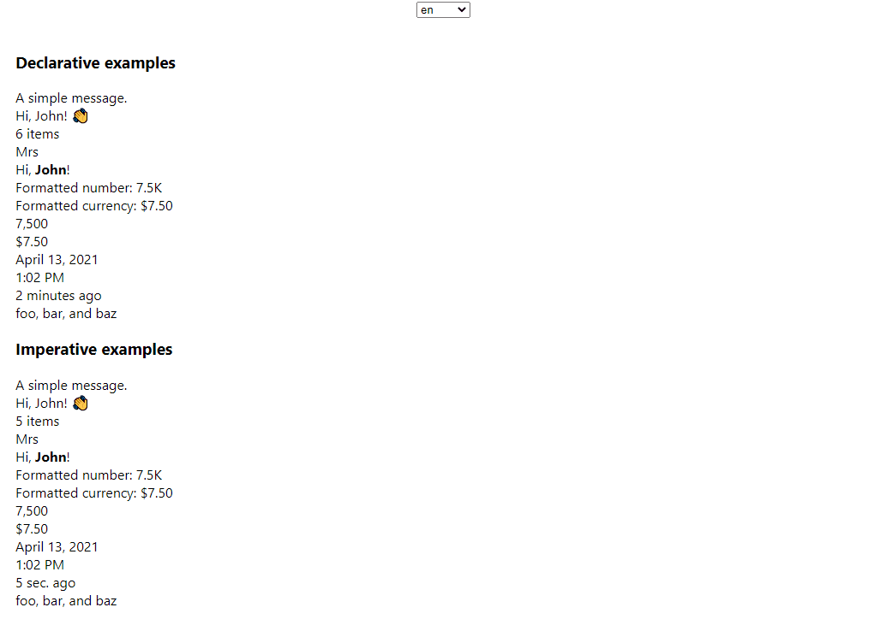

# React Intl + Vite example



This project is an example on how to do internationalization (i18n) in React projects with the [react-intl](https://www.npmjs.com/package/react-intl) library. It follows the [React-Intl tutorial](https://localizely.com/blog/react-intl-tutorial/)
by Localizely.

It contains examples for:

- The `IntlProvider` config
- Detection of the user's preferred language
- Loading translations dynamically
- Language switcher
- Setting text direction (`ltr`, `rtl`)
- Declarative usage of the `react-intl` library
- Imperative usage of the `react-intl` library

## Requirements

- Node
- npm
- git

## Getting started

First clone the examples repository and change to the `react-intl-demo` directory:

```bash
git clone https://github.com/TranslateRN/i18n-examples.git
cd i18n-examples/react-intl-demo
```

Install the dependencies:

```bash
npm install
```

Then start the development server:

```bash
npm run dev
```
